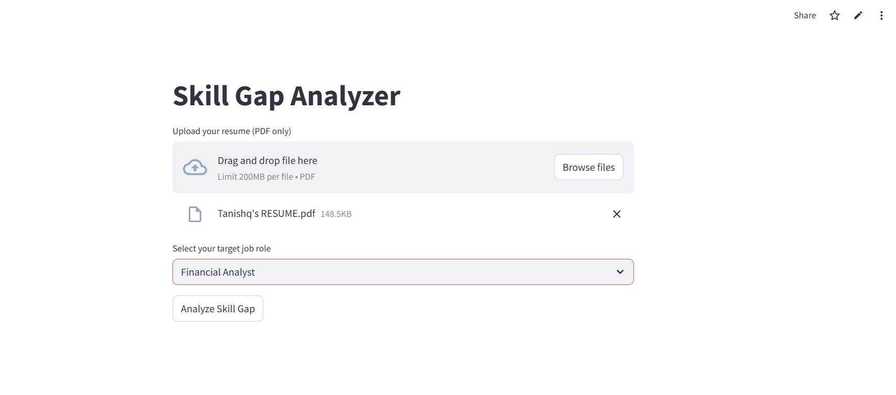
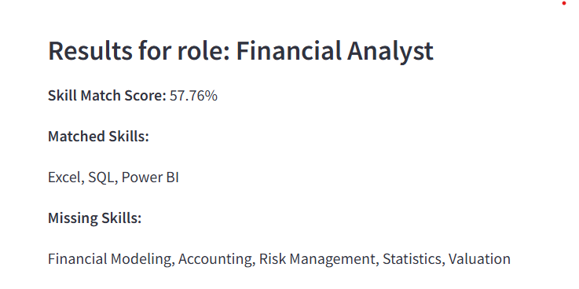
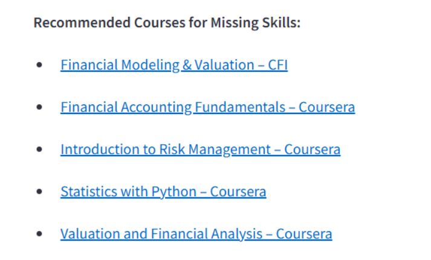

# 🎯 Skill Gap Analyzer

> Identify the skill gap between your resume and your target job role — and get free course recommendations to fill the gap.

---

## 🌐 Live App

👉 [Click here to try the Skill Gap Analyzer](https://iurd4upvokss2kjdazhaxd.streamlit.app/)

---

## 🚀 Features

- 📄 Upload your resume (PDF)
- 🎯 Select a job role (Data Analyst, Software Engineer, etc.)
- 🧠 Extract and match skills using AI
- 📊 View:
  - ✅ Matched skills
  - ❌ Missing skills
  - 📈 Match percentage
  - 🎓 Recommended courses to improve

---

## 🛠️ Tech Stack

- Python
- Streamlit
- Flask (API)
- PyMuPDF (PDF parser)
- SentenceTransformers (`all-MiniLM-L6-v2`)
- NumPy

---

## 📸 Screenshots

> Add these images inside a `screenshots/` folder

- **Upload Resume & Select Role**  
  

- **Skill Gap Results**  
  

- **Course Recommendations**  
  

